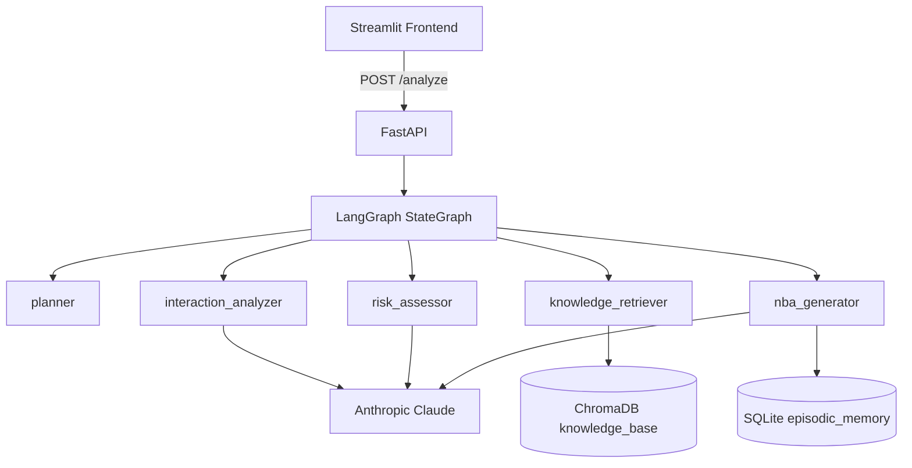

# P3 — Frontend / Demo Lead

**Role:** Build the FastAPI backend server, React/Vite frontend, documentation, and record the demo.
**Timeline:** 3 days. Work in `backend/main.py`, `figma/`, and `docs/`.

---

## Files You Own

```
backend/
└── main.py
figma/
├── package.json                  # Frontend deps (pnpm)
├── vite.config.ts                # Build config
├── src/
│   └── app/App.tsx               # React SPA — single-page app
└── dist/                         # Pre-built static bundle
docs/
├── ARCHITECTURE.md
└── demo_script.md
README.md
```

**Dependencies:** `fastapi`, `uvicorn`, `httpx`, `pydantic`, `python-dotenv`; frontend uses React 18 + Vite + Tailwind + shadcn/ui

---

## Interface Contracts

### You Consume (from P1)
- `backend/agents/graph.py` — `run(raw_input: str, account_id: str) -> RecommendationOutput`
- `backend/models/schemas.py` — `AgentStep`, `Evidence`, `Action`, `MemoryContext`, `RecommendationOutput`

### You Consume (from P2)
- `backend/memory/episodic.py` — `log_feedback(data: dict)`
- `backend/data/customer_profiles/*.json` — for account dropdown labels

---

## Day 1 — FastAPI Skeleton + Streamlit Shell + Agent Trace

### 1. `backend/main.py`
```python
from fastapi import FastAPI
from pydantic import BaseModel
from backend.agents.graph import run
from backend.memory.episodic import EpisodicMemory
from backend.models.schemas import RecommendationOutput
import os, uuid

app = FastAPI(title="Meridian")
mem = EpisodicMemory()

class AnalyzeRequest(BaseModel):
    account_id: str
    interaction_text: str

class FeedbackRequest(BaseModel):
    request_id: str
    account_id: str
    risk_score: float
    risk_level: str
    recommendation_title: str
    decision: str
    modification_notes: str = ""

@app.post("/analyze", response_model=RecommendationOutput)
def analyze(req: AnalyzeRequest):
    return run(req.interaction_text, req.account_id)

@app.post("/feedback")
def feedback(req: FeedbackRequest):
    mem.log_feedback({
        "account": req.account_id,
        "risk_score": req.risk_score,
        "risk_level": req.risk_level,
        "recommendation_title": req.recommendation_title,
        "decision": req.decision,
        "modification_notes": req.modification_notes,
        "outcome": "pending",
        "timestamp": __import__("datetime").datetime.utcnow().isoformat()
    })
    return {"status": "logged"}

@app.get("/health")
def health():
    return {"status": "ok"}
```

Run with: `uvicorn backend.main:app --reload --port 8000`

### 2. `frontend/app.py` — Skeleton
```python
import streamlit as st
import httpx, os, json, glob

st.set_page_config(page_title="Meridian", layout="wide")
API_URL = os.getenv("API_URL", "http://localhost:8000")

profiles = {}
for path in glob.glob("backend/data/customer_profiles/*.json"):
    with open(path) as f:
        data = json.load(f)
    profiles[data["account_name"]] = os.path.basename(path).replace(".json", "")

with st.sidebar:
    st.header("Meridian")
    account_name = st.selectbox("Account", list(profiles.keys()))
    account_id = profiles[account_name]
    transcript = st.text_area("Paste meeting transcript", height=300)
    analyze_btn = st.button("Analyse account", type="primary")

if analyze_btn and transcript:
    with st.spinner("Running agent pipeline..."):
        r = httpx.post(f"{API_URL}/analyze", json={"account_id": account_id, "interaction_text": transcript}, timeout=120.0)
        r.raise_for_status()
        result = r.json()
        st.session_state["result"] = result
        st.session_state["account_id"] = account_id
        st.session_state["transcript"] = transcript

if "result" in st.session_state:
    result = st.session_state["result"]
    from frontend.components.agent_trace import render_agent_trace
    from frontend.components.recommendation_panel import render_recommendation_panel
    from frontend.components.memory_panel import render_memory_panel
    from frontend.components.hitl_widget import render_hitl_widget
    render_agent_trace(result["agent_trace"])
    render_recommendation_panel(result)
    if result.get("memory_context"):
        render_memory_panel(result["memory_context"])
    render_hitl_widget(result, account_id)
```

### 3. `frontend/components/agent_trace.py`
```python
import streamlit as st

def render_agent_trace(steps: list[dict]):
    with st.expander("Agent trace", expanded=True):
        for step in steps:
            cols = st.columns([1, 4, 2])
            cols[0].markdown(f"**{step['agent_name']}")
            cols[1].markdown(f"{step['action']}  
<span style='color:gray;font-size:12px'>{step['reasoning']}</span>", unsafe_allow_html=True)
            cols[2].markdown(f"<div style='text-align:right'>{step['duration_ms']} ms</div>", unsafe_allow_html=True)
```

---

## Day 2 — Full Recommendation Panel + HITL

### 4. `frontend/components/recommendation_panel.py`
```python
import streamlit as st

def render_recommendation_panel(result: dict):
    st.subheader(f"{result['account_name']} — Risk Assessment")
    c1, c2, c3 = st.columns([1, 2, 1])
    c1.metric("Risk Score", f"{result['risk_score']:.0%}")
    c2.progress(result['risk_score'])
    c3.metric("Signals", result['signal_count'])
    st.subheader("Evidence")
    for ev in result["evidence"][:3]:
        with st.container():
            badge_color = {"meeting_note": "#E6F1FB", "playbook": "#EEEDFE", "memory": "#EAF3DE", "crm": "#FFF4E6"}
            bg = badge_color.get(ev["source_type"], "#f0f0f0")
            st.markdown(f"<span style='background:{bg};padding:2px 8px;border-radius:4px;font-size:12px'>{ev['source_type']}</span> **{ev['source_name']}** — relevance {ev['relevance_score']:.2f}", unsafe_allow_html=True)
            st.caption(ev["excerpt"][:300])
    st.subheader("Primary Recommendation")
    primary = result["primary_recommendation"]
    st.markdown(f"### {primary['title']}")
    st.markdown(primary['description'])
    st.markdown(f"Confidence: **{primary['confidence']:.0%}** | Impact: {primary['estimated_impact']}")
    if result.get("alternatives"):
        st.subheader("Alternatives")
        for alt in result["alternatives"]:
            with st.expander(f"{alt['title']} ({alt['confidence']:.0%})"):
                st.write(alt['description'])
```

### 5. `frontend/components/memory_panel.py`
```python
import streamlit as st

def render_memory_panel(ctx: dict):
    if ctx.get("similar_cases_found", 0) == 0:
        return
    st.subheader("Memory Boost")
    st.markdown(f"**{ctx['similar_cases_found']}** similar cases found: {', '.join(ctx['precedent_accounts'])}")
    c1, c2 = st.columns(2)
    c1.metric("Base Confidence", f"{ctx['base_confidence']:.0%}")
    c2.metric("Boosted Confidence", f"{ctx['boosted_confidence']:.0%}", delta=f"+{ctx['confidence_boost']:.0%}")
```

### 6. `frontend/components/hitl_widget.py`
```python
import streamlit as st
import httpx, os

API_URL = os.getenv("API_URL", "http://localhost:8000")

def render_hitl_widget(result: dict, account_id: str):
    st.subheader("Human-in-the-Loop")
    c1, c2, c3 = st.columns(3)
    req_id = result["request_id"]
    payload = {
        "request_id": req_id,
        "account_id": account_id,
        "risk_score": result["risk_score"],
        "risk_level": result["risk_level"],
        "recommendation_title": result["primary_recommendation"]["title"]
    }
    if c1.button("Accept", use_container_width=True):
        httpx.post(f"{API_URL}/feedback", json={**payload, "decision": "accept", "modification_notes": ""})
        st.success("Accepted and logged to memory.")
    if c2.button("Reject", use_container_width=True):
        httpx.post(f"{API_URL}/feedback", json={**payload, "decision": "reject", "modification_notes": ""})
        st.error("Rejected and logged.")
    if c3.button("Modify", use_container_width=True):
        st.session_state["show_modify"] = True

    if st.session_state.get("show_modify"):
        notes = st.text_area("What would you like to change?", placeholder="e.g., Change primary action to onboarding check-in")
        if st.button("Submit modification"):
            httpx.post(f"{API_URL}/feedback", json={**payload, "decision": "modify", "modification_notes": notes})
            st.info("Modification logged. Re-analyzing with feedback...")
            new_text = st.session_state.get("transcript", "") + "

[CSM Feedback: " + notes + "]"
            r = httpx.post(f"{API_URL}/analyze", json={"account_id": account_id, "interaction_text": new_text}, timeout=120.0)
            st.session_state["result"] = r.json()
            st.rerun()
```

### 7. Wire everything in `app.py`
Ensure the full flow works: select account -> paste transcript -> click Analyse -> see trace -> risk -> evidence -> memory (if any) -> primary -> alternatives -> HITL buttons.

---

## Day 3 — Architecture + README + Demo

### 8. `docs/ARCHITECTURE.md`
Write a Mermaid diagram showing:
- Streamlit frontend -> FastAPI -> LangGraph (5 agents)
- LangGraph nodes: planner -> interaction_analyzer -> knowledge_retriever -> risk_assessor -> nba_generator
- ChromaDB (2 collections: knowledge_base, resolved_cases)
- SQLite episodic memory
- Anthropic Claude API

Example Mermaid:


### 9. `README.md` (project root)
Include:
- One-line description: "Meridian — Decision intelligence for customer success teams"
- Prerequisites: Python 3.11, `pip`, `git`
- Setup:
  ```bash
  pip install -r requirements.txt
  python scripts/ingest.py
  python scripts/seed_memory.py
  uvicorn backend.main:app --port 8000
  # new terminal
  cd figma/dist && python3 -m http.server 5173
  ```
- Screenshot placeholder: ``
- Team members and roles

### 10. `docs/demo_script.md`
Script for the 5-minute video:

**Scene 1 — Acme Corp (cold start)**
1. Open Streamlit. Select "Acme Corp". Paste transcript.
2. Click Analyse. Narrate: "Sarah just got off a difficult call."
3. Show: 84% risk, 4 signals, primary = "Schedule EBR within 48h", confidence 73%.
4. Click Accept. Say: "Logged to memory."

**Scene 2 — Globex Corp (healthy)**
1. Select "Globex Corp". Paste transcript.
2. Show: 12% risk, primary = "Propose enterprise upgrade", confidence 88%.
3. Narrate: "Meridian handles expansion, not just churn."

**Scene 3 — TechCorp (memory boost)**
1. Select "TechCorp". Paste transcript.
2. Show: memory panel appears. "2 similar cases found (Acme Corp, GlobexQ1)."
3. Show confidence jump: 73% -> 89%.
4. Narrate: "The platform learned from the Acme case we just resolved. This is the differentiator."

### 11. Record videos
- 5-min demo video following the script.
- 5-min architecture walkthrough: open `graph.py`, show state transitions, explain memory boost formula, show Pydantic schemas.

### 12. Final push
- Tag release: `git tag v1.0.0-hackathon && git push origin v1.0.0-hackathon`
- Verify README renders on GitHub.

---

## Checklist Before Handoff

- [ ] `uvicorn backend.main:app` starts without errors
- [ ] `cd figma/dist && python3 -m http.server 5173` opens in browser at localhost:5173
- [ ] Full flow works: select account -> analyse -> see all components -> accept/reject/modify
- [ ] `/health` returns `{"status": "ok"}`
- [ ] `/feedback` logs entries to SQLite (verify with `sqlite3 episodic_memory.db "SELECT * FROM memory_log;"`)
- [ ] Architecture diagram renders in GitHub preview
- [ ] Demo video is recorded and uploaded (or linked)
