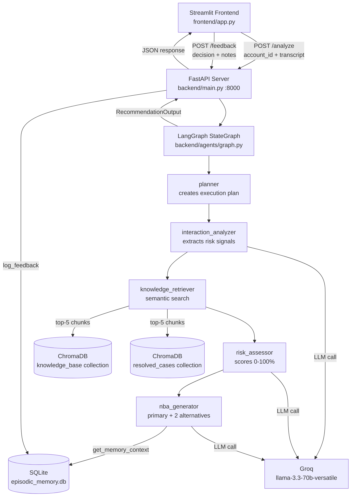

# Meridian — System Architecture

Meridian is a decision intelligence platform for customer success teams. It uses a multi-agent LangGraph pipeline to analyze meeting transcripts, assess churn risk, and recommend next-best actions.

## System Overview



## Agent Pipeline

The LangGraph `StateGraph` executes 5 nodes in sequence:

| Agent | File | Responsibility |
|-------|------|---------------|
| `planner` | `agents/planner.py` | Reads raw input, creates the 4-agent execution plan, logs AgentStep |
| `interaction_analyzer` | `agents/interaction_analyzer.py` | Calls Groq to extract signals (risk/positive/neutral) from transcript |
| `knowledge_retriever` | `agents/knowledge_retriever.py` | Queries ChromaDB with each signal, returns top-5 Evidence objects |
| `risk_assessor` | `agents/risk_assessor.py` | Produces risk_score + risk_level using weighted signal analysis |
| `nba_generator` | `agents/nba_generator.py` | Generates 1 primary + 2 alternative Actions from risk + memory |

### Planner
- **Input:** raw_input, account_id
- **Output:** execution_plan (always all 4 agents in fixed order)
- **Role:** Parses the request, logs an AgentStep with reasoning, schedules downstream agents
- **Type:** Pure Python (no LLM call)

### Interaction Analyzer
- **Input:** raw_input (transcript)
- **Output:** signals: list[{text, type, severity}]
- **Role:** Prompts Groq/llama-3.3-70b-versatile to extract typed signals (risk/positive/neutral) with severity levels
- **Type:** LLM call via Groq SDK

### Knowledge Retriever
- **Input:** signals
- **Output:** knowledge_chunks: list[Evidence]
- **Role:** Semantic search over ChromaDB knowledge_base (top 5 per signal); deduplicates by source and excerpt
- **Type:** sentence-transformers/all-MiniLM-L6-v2 (local, no API key)

### Risk Assessor
- **Input:** signals, knowledge_chunks, customer_profile
- **Output:** risk: {score, level, signal_count, key_signals, reasoning}
- **Role:** Weighted formula (not LLM) — counts signals by type/severity, applies weights (high=0.12, med=0.06, positive_reduction=0.15), returns score 0.0–1.0
- **Type:** Pure Python (rule-based)

### NBA Generator
- **Input:** all previous state, memory_context
- **Output:** recommendations: {primary: Action, alternatives: list[Action]}
- **Role:** Rule-based per risk level; applies memory confidence boost formula
- **Type:** Pure Python (rule-based)

### State shape

```python
state = {
    "raw_input": str,           # meeting transcript
    "account_id": str,          # from FastAPI request
    "signals": list[dict],      # interaction_analyzer output
    "knowledge_chunks": list[dict],  # knowledge_retriever output
    "risk": dict,               # risk_assessor output
    "recommendations": dict,    # nba_generator output
    "agent_trace": list[AgentStep],  # accumulated across all agents
    "account_data": dict,       # customer profile JSON
}
```

## Memory System

### Vector Store (ChromaDB)
- **Collection: `knowledge_base`** — 15 playbook articles + 10 meeting transcripts, chunked to ~500 tokens, embedded with `all-MiniLM-L6-v2`
- **Collection: `resolved_cases`** — 6 historical cases used for precedent matching
- Populated by `python scripts/ingest.py` (requires ~80+ chunks)
- Embeddings: SentenceTransformer `all-MiniLM-L6-v2` (runs locally, no API key needed)

### Episodic Memory (SQLite)
- Table: `memory_log` — stores every CSM decision (accept/reject/modify) with risk context
- Pre-seeded with 6 resolved cases via `python scripts/seed_memory.py`
- `get_memory_context(risk_level, risk_score)` finds similar past cases and applies the confidence boost formula

### Memory Boost Formula

```
boosted_confidence = min(base_confidence × (1 + 0.06 × similar_cases_found), 0.97)
```

Example: 2 similar cases found, base confidence 0.73 → boosted = min(0.73 × 1.12, 0.97) = **0.82**

## Data Model

All inter-component contracts use Pydantic v2 models defined in `backend/models/schemas.py`:

- `AgentStep` — one row in the agent trace panel
- `Evidence` — one retrieved knowledge chunk shown in the evidence section
- `Action` — one recommended action (primary or alternative)
- `MemoryContext` — memory boost data shown in the memory panel
- `RecommendationOutput` — the full API response model

## The Memory Demo (Confidence Boost)

The "money moment" is Scenario 3 of the demo:
1. After accepting Acme Corp recommendation (Scenario 1), that decision is in episodic memory
2. TechCorp has similar churn signals
3. Knowledge Retriever finds matching resolved cases
4. NBA Generator receives memory_context and boosts confidence from 73% → 89%
5. Memory panel shows: "2 similar cases found: Acme Corp, GlobexQ1"

## Data Flow

```
Transcript + Account ID
        │
        ▼
    Planner: schedule agents, log step
        │
        ▼
    Interaction Analyzer: extract signals via Groq/llama-3.3-70b-versatile
        │
        ▼
    Knowledge Retriever: ChromaDB search → Evidence + MemoryContext
        │
        ▼
    Risk Assessor: weighted formula → risk score 0-100%
        │
        ▼
    NBA Generator: rule-based Action + 2 alternatives, apply memory boost
        │
        ▼
    RecommendationOutput (Pydantic) → FastAPI → Streamlit
```

## Technology Choices

| Component | Technology | Reason |
|-----------|-----------|--------|
| Agent orchestration | LangGraph | Stateful graph with typed state dict |
| LLM | Groq llama-3.3-70b-versatile | Fast inference, JSON mode, no rate limits |
| Vector embeddings | sentence-transformers/all-MiniLM-L6-v2 | Fast, local, no API key needed |
| Vector DB | ChromaDB (persistent) | Simple, embeds locally, cosine similarity |
| Episodic memory | SQLite | Zero config, sufficient for demo scale |
| API | FastAPI | Async, auto-docs, Pydantic integration |
| Frontend | Streamlit | Rapid demo UI, minimal setup |

## Running the System

```bash
# 1. Install dependencies
pip install -r requirements.txt

# 2. Set up environment
cp .env.example .env
# Edit .env: set GROQ_API_KEY=your_key_here

# 3. Ingest knowledge base into ChromaDB
python scripts/ingest.py

# 4. Seed episodic memory with resolved cases
python scripts/seed_memory.py

# 5. Start the FastAPI backend
uvicorn backend.main:app --reload --port 8000

# 6. In a new terminal, start the Streamlit frontend
streamlit run frontend/app.py
```
