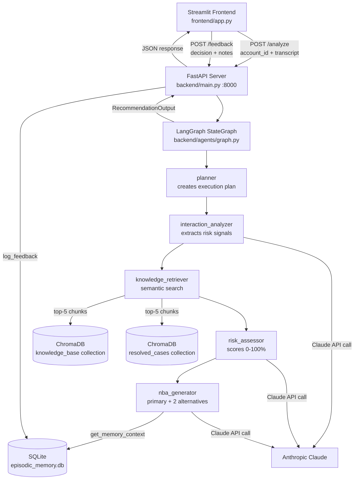

# Meridian — System Architecture

Meridian is a decision intelligence platform for customer success teams. It uses a multi-agent LangGraph pipeline to analyse meeting transcripts, assess churn risk, and recommend next-best actions.

## System Overview



## Agent Pipeline

The LangGraph `StateGraph` executes 5 nodes in sequence:

| Agent | File | Responsibility |
|-------|------|---------------|
| `planner` | `agents/planner.py` | Reads raw input, creates the 4-agent execution plan, logs AgentStep |
| `interaction_analyzer` | `agents/interaction_analyzer.py` | Calls Claude to extract signals (risk/positive/neutral) from transcript |
| `knowledge_retriever` | `agents/knowledge_retriever.py` | Queries ChromaDB with each signal, returns top-5 Evidence objects |
| `risk_assessor` | `agents/risk_assessor.py` | Calls Claude with signals + knowledge to produce risk_score + risk_level |
| `nba_generator` | `agents/nba_generator.py` | Calls Claude with risk + knowledge + memory to produce 1 primary + 2 alternative Actions |

### State shape

```python
state = {
    "raw_input": str,           # meeting transcript
    "account_id": str,          # from FastAPI request
    "signals": list[dict],      # interaction_analyzer output
    "knowledge_chunks": list[dict],  # knowledge_retriever output
    "risk": dict,               # risk_assessor output
    "recommendations": dict,    # nba_generator output
    "agent_trace": list[AgentStep],  # accumulated across all agents
    "account_data": dict,       # customer profile JSON
}
```

## Memory System

### Vector Store (ChromaDB)
- **Collection: `knowledge_base`** — 15 playbook articles + 10 meeting transcripts, chunked to ~500 tokens, embedded with `all-MiniLM-L6-v2`
- **Collection: `resolved_cases`** — 6 historical cases used for precedent matching
- Populated by `python scripts/ingest.py` (requires ~80+ chunks)

### Episodic Memory (SQLite)
- Table: `memory_log` — stores every CSM decision (accept/reject/modify) with risk context
- Pre-seeded with 6 resolved cases via `python scripts/seed_memory.py`
- `get_memory_context(risk_level, risk_score)` finds similar past cases and applies the confidence boost formula

### Memory Boost Formula

```
boosted_confidence = min(base_confidence × (1 + 0.06 × similar_cases_found), 0.97)
```

Example: 2 similar cases found, base confidence 0.73 → boosted = min(0.73 × 1.12, 0.97) = **0.82**

## Data Model

All inter-component contracts use Pydantic v2 models defined in `backend/models/schemas.py`:

- `AgentStep` — one row in the agent trace panel
- `Evidence` — one retrieved knowledge chunk shown in the evidence section
- `Action` — one recommended action (primary or alternative)
- `MemoryContext` — memory boost data shown in the memory panel
- `RecommendationOutput` — the full API response model

## Running the System

```bash
# 1. Install dependencies
pip install -r requirements.txt

# 2. Set up environment
cp .env.example .env
# Edit .env: set ANTHROPIC_API_KEY

# 3. Ingest knowledge base into ChromaDB
python scripts/ingest.py

# 4. Seed episodic memory with resolved cases
python scripts/seed_memory.py

# 5. Start the FastAPI backend
uvicorn backend.main:app --reload --port 8000

# 6. In a new terminal, start the Streamlit frontend
streamlit run frontend/app.py
```
